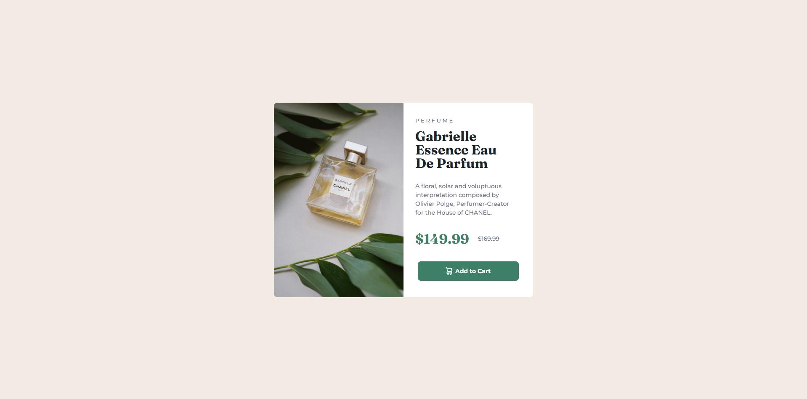

# Frontend Mentor - Product preview card component solution

This is a solution to the [Product preview card component challenge on Frontend Mentor](https://www.frontendmentor.io/challenges/product-preview-card-component-GO7UmttRfa). Frontend Mentor challenges help you improve your coding skills by building realistic projects.

## Table of contents

- [Overview](#overview)
  - [The challenge](#the-challenge)
  - [Screenshot](#screenshot)
  - [Links](#links)
- [My process](#my-process)
  - [Built with](#built-with)
  - [What I learned](#what-i-learned)
  - [Continued development](#continued-development)

## Overview

### The challenge

Users should be able to:

- View the optimal layout depending on their device's screen size
- See hover and focus states for interactive elements

### Screenshot



### Links

- Solution URL: [Solution URL](https://www.frontendmentor.io/solutions/responsive-product-preview-card-using-flexbox-and-custom-css-gVJrPp9xOT)
- Live Site URL: [Live URL](https://juanfeoru.github.io/product-preview-card-component/)

## My process

### Built with

- Semantic HTML5 markup
- CSS custom properties
- Flexbox
- Mobile-first workflow

### What I learned

This challenge helped me practice **BEM methodology** and apply **responsive design** with `flexbox` and media queries.  
I also learned how to handle **border-radius with images** using `overflow: hidden` and how to align icons with text inside a button using `flexbox`.

```css
.product__button {
  display: flex;
  align-items: center;
  justify-content: center;
  gap: 0.5rem;
}
```

### Continued development

I want to continue focusing on:

- Improving responsive layouts with Grid and Flexbox
- Mastering accessibility and semantic HTML
- Writing cleaner and more scalable CSS
